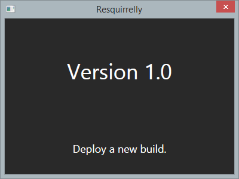
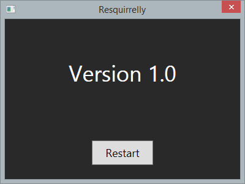
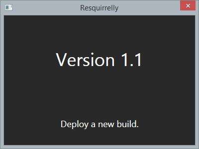

Resquirrelly
====================

> A Squirrel sample app for app updates and restarts

This sample app uses [Squirrel.Windows](https://github.com/Squirrel/Squirrel.Windows)
for its installation and automatic updates. The app will run for the first time
immediately after installation (like most Squirrel installed apps) and wait for
an update. Once it detects an update (using a 20 second polling interval), it will
show a **Restart** button, which will restart the app when selected. The rest of
this document will walk you through how to set up this sample and run it. 

I built this sample because I was struggling to get Squirrel to restart the app
after it detected and downloaded an update. Part of the solution was to comment
out a line of Squirrel code. Therefore, the Squirrel project is part of this 
solution as a submodule. I hope to change this after I get more guidance from 
the community. More info below.

## Prerequisites

* Hosting. You will need a place to host the deployment updates with a 
public URL that Resquirrelly can poll. Azure Blob storage was used in putting 
this together, but most types of HTTP hosting (Amazon S3, GitHub Pages, etc.) 
should work fine.

* NuGet. You'll need to have the [NuGet Command Line Utility](http://nuget.org/nuget.exe)
installed and in your %PATH%. This is used by a script thats been included to make
doing the deployments faster/easier. You'll also need NuGet installed with Visual
Studio (VS) [2013].

## Setup

1. Using VS, open the solution and open `UpdateHelper.cs`.
2. Edit line 6 to be the address where Resquirrelly can find the deployments 
you're going to upload.
3. Build the solution. _NuGet Package Restore_ is enabled so the packages should 
be downloaded and installed when you build. Be sure they do.

## The first build

1. Open a command line tool (cmd.exe) and navigate to Resquirrelly's source code 
folder (where the *.sln file is). 
2. Enter the following command: `release 1.0` and let it finish.
3. In the Releases folder, upload `RELEASES` and `Resquirrelly-1.0-full.nupkg` to the 
HTTP location you're hosting your deployment packages. In a real world scenario,
you would probably also upload `ResquirrellyInstaller.exe`.
4. After the upload finishes, run `ResquirrellyInstaller.exe` to install and run 
Resquirrelly.
5. Leave it running.

## Deployments

1. Using VS, open `MainWindow.xaml` and change line 16 to "Version 1.1" so it will
be obvious when the update has been applied.
2. Build the solution.
3. Back on the command line, enter: `release 1.1`
4. From the Releases folder, upload `Resquirrelly-1.1-delta.nupkg`, 
`Resquirrelly-1.1-full.nupkg` to your HTTP deployment location (hold off on 
`RELEASES` for the moment). In a real world scenario, you would probably upload 
an update of the installer also.
5. Only after the other files have finished uploading, upload `RELEASES`. This 
is the file Squirrel is polling for, so you want the other files in place first.
6. In less than 20 seconds, Resquirrelly will detect the update, download it, and
display the **Restart** button.

7. Select it to restart and launch Resquirrelly 1.1.

8. Deploying new versions is just a matter of repeating these steps.

## More info

* The line of the Squirrel source code I commented out is the last line of 
`UpdateManager.RestartApp()` which closes the currently running app. I think this 
line may be called too soon, which might not be giving the call to `Update.exe` 
enough time to grab the PID of the app before shutting it down. Before 
Resquirrelly closes itself in, the button handler it is just doing an 
`await Task.Delay(1000)` to give it more time. Not at all elegant, but hopefully 
it's only temporary until I get better guidance from the community.

* The script that does the builds (release.bat) is currently using a debug build. 
If you need to use a release build for whatever reason, be sure to change the 
script to use Resquirrelly.Release.nuspec. It doesn't include the symbols.

Let me know if you have any questions.

